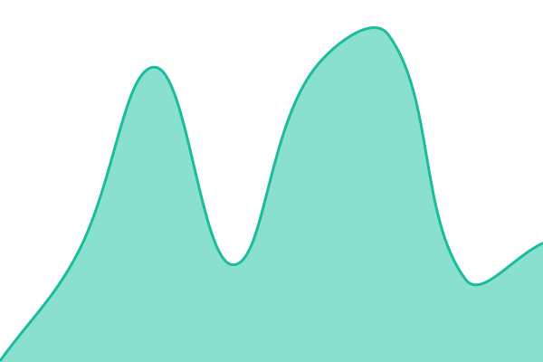

# [📈 Live Status](https://status.nighthawk.co.za): <!--live status--> **🟧 Partial outage**

This repository contains the open-source uptime monitor and status page for [Clifford W. Hansen](http://nighthawk.co.za), powered by [Upptime](https://github.com/upptime/upptime).

With [Upptime](https://upptime.js.org), you can get your own unlimited and free uptime monitor and status page, powered entirely by a GitHub repository. We use [Issues](https://github.com/cliffordwhansen/upptime/issues) as incident reports, [Actions](https://github.com/cliffordwhansen/upptime/actions) as uptime monitors, and [Pages](https://status.nighthawk.co.za) for the status page.

<!--start: status pages-->
<!-- This summary is generated by Upptime (https://github.com/upptime/upptime) -->
<!-- Do not edit this manually, your changes will be overwritten -->
<!-- prettier-ignore -->
| URL | Status | History | Response Time | Uptime |
| --- | ------ | ------- | ------------- | ------ |
|  [Requests](https://requests.nighthawk.co.za/login) | 🟩 Up | [requests.yml](https://github.com/cliffordwhansen/upptime/commits/HEAD/history/requests.yml) | 

 1364ms
     
 | 

<a href="https://status.nighthawk.co.za/history/requests">100.00%</a>
    

|  [Plex](https://plex.nighthawk.co.za) | 🟩 Up | [plex.yml](https://github.com/cliffordwhansen/upptime/commits/HEAD/history/plex.yml) | 

 701ms
     
 | 

<a href="https://status.nighthawk.co.za/history/plex">100.00%</a>
    

|  [Jellyfin](https://jellyfin.nighthawk.co.za/web/) | 🟩 Up | [jellyfin.yml](https://github.com/cliffordwhansen/upptime/commits/HEAD/history/jellyfin.yml) | 

 689ms
     
 | 

<a href="https://status.nighthawk.co.za/history/jellyfin">100.00%</a>
    

|  [Minecraft](https://minecrafft.nighthawk.co.za) | 🟥 Down | [minecraft.yml](https://github.com/cliffordwhansen/upptime/commits/HEAD/history/minecraft.yml) | 

 0ms
     
 | 

<a href="https://status.nighthawk.co.za/history/minecraft">35.07%</a>
    

|  [Requests IPv6](https://requests.nighthawk.co.za/login) | 🟩 Up | [requests-i-pv6.yml](https://github.com/cliffordwhansen/upptime/commits/HEAD/history/requests-i-pv6.yml) | 

 783ms
     
 | 

<a href="https://status.nighthawk.co.za/history/requests-i-pv6">100.00%</a>
    

|  [Plex IPv6](https://plex.nighthawk.co.za) | 🟩 Up | [plex-i-pv6.yml](https://github.com/cliffordwhansen/upptime/commits/HEAD/history/plex-i-pv6.yml) | 

 665ms
     
 | 

<a href="https://status.nighthawk.co.za/history/plex-i-pv6">100.00%</a>
    

|  [Jellyfin IPv6](https://jellyfin.nighthawk.co.za/web/) | 🟩 Up | [jellyfin-i-pv6.yml](https://github.com/cliffordwhansen/upptime/commits/HEAD/history/jellyfin-i-pv6.yml) | 

 683ms
     
 | 

<a href="https://status.nighthawk.co.za/history/jellyfin-i-pv6">100.00%</a>
    

|  [Minecraft IPv6](https://minecrafft.nighthawk.co.za) | 🟥 Down | [minecraft-i-pv6.yml](https://github.com/cliffordwhansen/upptime/commits/HEAD/history/minecraft-i-pv6.yml) | 

 0ms
     
 | 

<a href="https://status.nighthawk.co.za/history/minecraft-i-pv6">61.95%</a>
    

<!--end: status pages-->

[**Visit our status website →**](https://status.nighthawk.co.za)

## 📄 License

- Powered by: [Upptime](https://github.com/upptime/upptime)
- Code: [MIT](./LICENSE) © [Anand Chowdhary](https://anandchowdhary.com)
- Data in the `./history` directory: [Open Database License](https://opendatacommons.org/licenses/odbl/1-0/)
